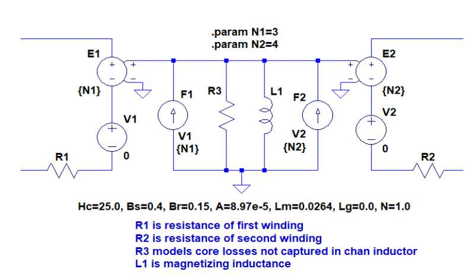

# Introduction

This module is based on the design procedure described in
[Designing Planar Magnetics](http://www.ti.com/download/trng/docs/seminar/Topic4LD.pdf).
The paper uses a 500kHz forward converter with 48V input and 2.5V output
as an example of the design procedure.  This introduction will use the same example
to introduce the `PlanerTransformer` API.

Load the module.
```@example intro
using PlanerTransformer
```

Define the operating frequency and maximum specific power loss for the transformer
```@example intro
frequency = 0.5e6 # Hz
spl_max = 150e3 # W/m^3
nothing # hide
```

Standard core geometries are available in `core_geometry_dict`.
  An ER25 core / plate set will be used.
```@example intro
core = core_geometry_dict["er25/5.5_plt"]
nothing # hide
```

The properities of some ferrites are available in `ferrite_dict`.
```@example intro
ferrite = ferrite_dict["3f35"]
nothing # hide
```

The functions `specific_power_loss` and `flux_density` interpolate the specific
power loss curves from the data sheet.

`flux_density` returns the maximum flux density for given specific power loss
for two ferrites.
```@example intro
flux_density_max_pp = flux_density(ferrite, spl_max, frequency) * 2.0 # Tesla
```

Calculate volt seconds per turn.
```@example intro
vspt = volt_seconds_per_turn(core, flux_density_max_pp)
```

Maximum output voltage for forward converter with 1T secondary.
```@example intro
duty = 0.5 # 50% maximum duty cycle
t_on = duty/frequency
v_peak_at_transformer_1t = vspt/t_on # always work with peak I,V at transformer
v_out_forward_converter = v_peak_at_transformer_1t * duty #  vspt * frequency
```

## Transformer with Double Sided PCB

Start by defining the  PCB with `PCB_Specification`.  This transformer will be
built with a double sided PCB with 4oz copper.
```@example intro
trace_edge_gap = 0.5e-3
trace_trace_gap = 0.4e-3
copper_thickness = copper_weight_to_meters(4.0) # 4.0oz copper
dielectric_thickness = 0.125e-3
stackup = Stackup((copper,           fr408,                copper),
                  (copper_thickness, dielectric_thickness, copper_thickness))
pcb = PCB_Specification(trace_edge_gap,
                        trace_trace_gap,
                        stackup)
nothing # hide
```
Specify the `windings`.  `PlanerTransformer` only allows transformers with two
windings. All primary layers must have the same number of turns.  All secondary
layers must have the same number of turns.  Primary and secondary layers may be
in series or parallel.  For this transformer, the primary is a single layer with
6 turns. The secondary is a single layer with 1 turn.
```@example intro
primary_turns_per_layer = 6
secondary_turns_per_layer = 1
is_layer_primary = (true, false) # which layers belong to primary and secondary
are_primary_layers_in_series = false
are_secondary_layers_in_series = false
my_windings = windings(pcb, core,
                       primary_turns_per_layer,
                       secondary_turns_per_layer,
                       is_layer_primary,
                       are_primary_layers_in_series,
                       are_secondary_layers_in_series)
nothing # hide
```

`volt_seconds` returns a tuple of the maximum volt seconds on (primary, secondary)
to stay within the core flux density peak-peak.

Maximum voltage at the input output of the converter.
```@example intro
max_volts_transformer_peak = volt_seconds(my_windings,flux_density_max_pp)./t_on
(input, output) = (max_volts_transformer_peak[1], max_volts_transformer_peak[2]*duty)
```

Create a transformer by combining a ferrite with windings.
```@example intro
transformer_3f35_2layer = Transformer(ferrite, my_windings)
nothing # hide
```

Verify 6:1 turns ratio.
```@example intro
turns(transformer_3f35_2layer) # (primary, secondary)
```

Leakage inductance is referenced to primary.
```@example intro
leakage_inductance(transformer_3f35_2layer)
```

To calculate power dissipation, the operating conditions must be specified.

Define parameters for the switching power supply using the transformer.  Power must flow
from primary to secondary (v_in positive, i_out negative).
```@example intro
v_in = 48.0
i_out = -7.0
duty = 0.50
my_converter = Forward(v_in, i_out, frequency, duty) # or PushPull
nothing # hide
```
!!! note
    Within `PlanerTrnasformer` Voltages and currents are peak at the transformer,
    and powers are averages. They are not the DC input and output of the switching
    power supply.

Calculate power dissipation, and other stuff,  of a transformer in a
 switching power supply.
```@example intro
tpa = transformer_power_analysis(transformer_3f35_2layer, my_converter)
nothing # hide
```

Many parameters can be displayed
```@example intro
voltage(tpa) # (primary, secondary)
```
```@example intro
current(tpa) # (primary, secondary)
```
```@example intro
input_power(tpa)
```
```@example intro
output_power(tpa)
```
```@example intro
ac_winding_resistance(tpa) # (primary, secondary)
```
```@example intro
dc_winding_resistance(tpa) # (primary, secondary)
```
```@example intro
equilivent_resistance(tpa) # (primary, secondary)
```
```@example intro
core_specific_power(tpa) # W/m^3
```
```@example intro
core_total_power(tpa)
```
```@example intro
winding_power(tpa) # (primary, secondary)
```
```@example intro
total_power(tpa)
```

Total power dissipation with 20A output
```@example intro
converter_20 =  Forward(v_in,-20.0,frequency,duty) # same as above, except 20A
total_power(transformer_power_analysis(transformer_3f35_2layer, converter_20))
```
The next three sections Double and Interleave the Windings,
Copper Strip Secondary, and Primary in Series are a series of improvements on
this transformer.

## Double and Interleave the Windings
```@example intro
b_stage_thickness = 0.0762
double_stackup = Stackup((copper,           fr408,                copper,           fr408,             copper,
                         fr408,                copper),
                         (copper_thickness, dielectric_thickness, copper_thickness, b_stage_thickness, copper_thickness, dielectric_thickness, copper_thickness))
double_pcb = PCB_Specification(trace_edge_gap,
                               trace_trace_gap,
                               double_stackup)
double_windings = windings(double_pcb, core,
                           primary_turns_per_layer,
                           secondary_turns_per_layer,
                           prisec"S-P-P-S", # use prisec string to specify which layers are primary and secondary.
                           are_primary_layers_in_series,
                           are_secondary_layers_in_series)

double_transformer_3f35 = Transformer(ferrite_dict["3f35"], double_windings)
double_tpa = transformer_power_analysis(double_transformer_3f35, my_converter)
total_power(transformer_power_analysis(double_transformer_3f35, converter_20))
```

## Copper Strip Secondary
```@example intro
strip_stackup = Stackup((copper,                 fr408,                copper,           fr408,             copper,
                         fr408,                copper),
                         (copper_thickness+1e-3, dielectric_thickness, copper_thickness, b_stage_thickness, copper_thickness, dielectric_thickness, copper_thickness+1e-3))
strip_pcb = PCB_Specification(trace_edge_gap,
                              trace_trace_gap,
                              strip_stackup)
strip_windings = windings(strip_pcb, core,
                          primary_turns_per_layer,
                          secondary_turns_per_layer,
                          prisec"S-P-P-S",
                          are_primary_layers_in_series,
                          are_secondary_layers_in_series)

strip_transformer_3f35 = Transformer(ferrite_dict["3f35"], strip_windings)
strip_tpa = transformer_power_analysis(strip_transformer_3f35, my_converter)
total_power(transformer_power_analysis(strip_transformer_3f35, converter_20))
```

## Primary in Series
```@example intro
series_windings = windings(strip_pcb, core,
                          3, # turns per layer, primary
                          secondary_turns_per_layer,
                          prisec"S-P-P-S",
                          true, # primary layers are in series
                          are_secondary_layers_in_series)

series_transformer_3f35 = Transformer(ferrite_dict["3f35"], series_windings)
series_tpa = transformer_power_analysis(series_transformer_3f35, my_converter)
total_power(transformer_power_analysis(series_transformer_3f35, converter_20))
```

## LTspice Model

Parameters for a circuit simulation can be extracted.
```@example intro
(n1, n2) = turns(series_transformer_3f35)
```
```@example intro
l2 = leakage_inductance(series_transformer_3f35)
```
```@example intro
l1 = chan_inductor(series_transformer_3f35)
```
```@example intro
c1 = c2 = 0.5*capacitance(series_transformer_3f35)
```
```@example intro
(r1, r2) = equilivent_resistance(series_tpa)
```
```@example intro
r3 = r_core(series_tpa)
```


